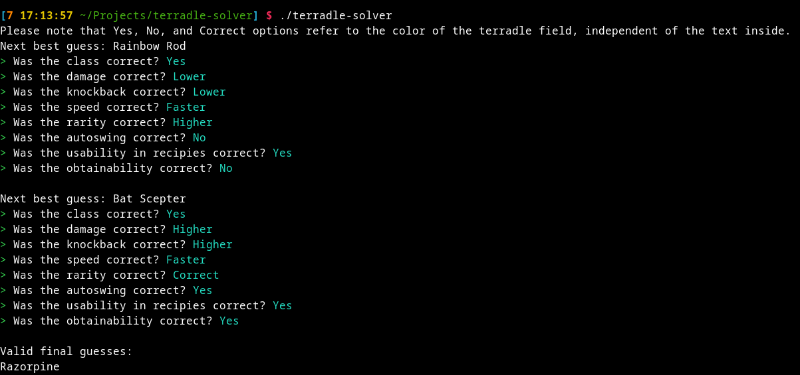
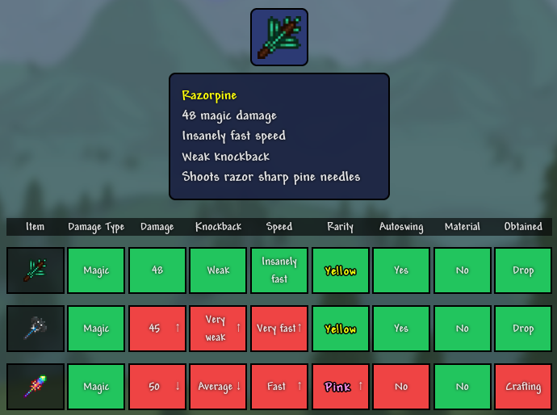

# terradle-solver
An algorithm to solve [https://www.terradle.com/](terradle.com).

The algorith determines the guess with the lowest average (arithmetic mean) amount of possible weapons for the next guess, based on all possible sets of new information it could provide.

Dependencies:
- openssl header files

alternatively you can modify Cargo.toml to use rustls instead of native-tls

Download and build the project:
```
git clone https://github.com/Stachelbeere1248/terradle-solver.git
cd terradle-solver
cargo build -r
```
Interactively solve the terradle of the day:
```
./terradle-solver
```
Print a ranked list of all the openers:
```
./tarradle-solver --mode openers
```
List the amount of attempts the solver needs to determine the stats of every weapon. Note that it counts until it has found out the exact stats of the item, rather than the item itself. Due to luck, this results in slightly higher try-counts than an actual terradle would take, while not counting additional "random" tries when items have same stats.
```
./terradle-solver --mode simulate # | sort
```



